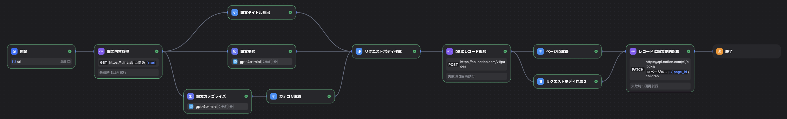

# Difyで構築するNotion上の論文DB作成支援ツール

## 手順
1. Notionで内部インテグレーション作成 (https://www.notion.so/profile/integrations)
    - 内部インテグレーションシークレットを保存
2. Notion上にデータベースを作成
    - URLからデータベースIDを保存
3. DifyでDSLファイルをインポートしてワークフロー作成
4. 環境変数設定 (シークレットキー、データベースID)
